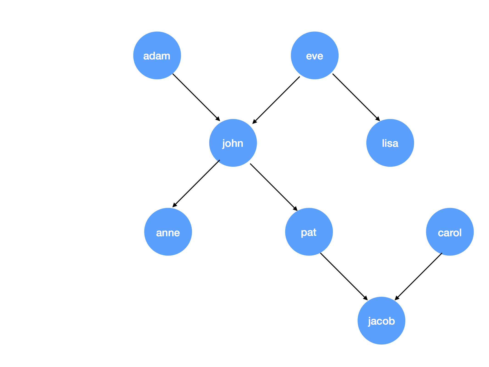

# IF.05.22 Theoretical Informatics 2017

## Objective
The goal of this assignment is to train first steps with Prolog.

## Materials
- gProlog
- An editor

## The Background
We consider a genealogy of the following form:

As an example we want to show the relationship between adam and john as well as between eve and john which can be expressed in Prolog with the following clauses.
```
parent(adam, john).
parent(eve, john).
```

## Required Tasks
1. Express the above given genealogy in Prolog. You only have to use the `parent` clause as introduced above. You should end up with a knowledge base of seven rules. Name it `genealogy.pl`.
2. Express the query "Who is the parent of pat?" in Prolog
3. Express the query "Does lisa have a child?"
4. Add two clauses `male/1` and `female/1` to the knowledge base. The decision who is male and who is female of the persons in your base is up to you.
4. Add a rule `grandparent/2` to your knowledge base which expresses that `GP` (the first argument) is a grandparent to `GC` (the second argument).

## Hints
- The notation `nameOfClause/n` is the common way to describe a clause `nameOfClause` which shall have an arity of `n`. Example: `grandparent/2` means a clause called `grandparent` with two arguments, say `GP` (grandparent) and `GC` (grandchild).
- A person `GP` is a grandparent of another person `GC` if and only if there exists
   - a person `C` which is parent of `GC`
   - and `GP` is parent of `C`.

## Things to Learn
- Prolog Clauses
- Simple Rules

## Evaluation
Do all the required tasks and make a pull request. If you make a pull request, you might have to chance to present your solution in our next training unit.
